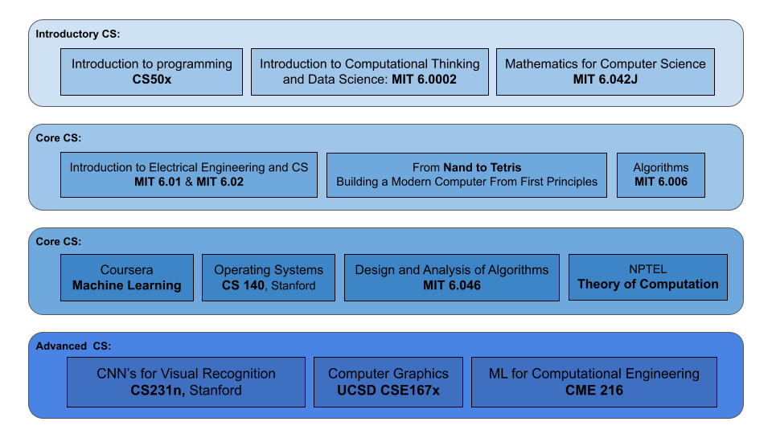

<h1 align=center> Open Source Computer Science Degree </h1>

This repo documents my work towards pursuing an undergrad Computer Science majors through open-sourced, university-level MOOC's that meets the requrements of **MIT's** [_Computer Science and Engineering (6-3)_](http://catalog.mit.edu/degree-charts/computer-science-engineering-course-6-3/).

Since, I already have a majors in Mechanical Engineering I have omitted general education and non-CS course requirements.

Curriculum was an adaptation of [_MIT CS degree_](http://catalog.mit.edu/degree-charts/computer-science-engineering-course-6-3/) and was also inspired by  . Majority of the courses were
available through MIT's Open Courseware and when available, courses with more interative versions from other universities (Stanford, UW, CMU, Harvard, UCSD, IIT) were opted.

All the course selected were based on these criteria.

**Courses must _______**
* have video lectures or good reading materials to follow along.
* have good set of assignments demonstrating those concepts in practice.
* have some form of autograder to evaluate my work.

All the courses are classified into three categories.
- **_Introductory_** : Getting started in CS.
- **_Core_** : corresponds roughly to first three years of a computer science curriculum, taking classes that all majors would be required to take.
- **_Advanced_** : corresponds roughly to the final year of a computer science curriculum, selecting electives according to my interests.

## Roadmap

----------------

 

## **Introduction to CS**

Courses | Prerequisites | School | CourseWork |
:--: | :--: | :--: | :--: |
[CS50x: Introduction to programming](https://cs50.harvard.edu/x/2021/) | none | Harvard | [repo](https://github.com/GopalKrishna-P/cs50x#readme) |
[MIT 6.0002: Intro to Computational Thinking and Data Science](https://ocw.mit.edu/courses/electrical-engineering-and-computer-science/6-0002-introduction-to-computational-thinking-and-data-science-fall-2016/index.htm) | none | MIT | [repo](https://github.com/GopalKrishna-P/MIT_6.0002#readme)
[MIT 6.042J: Maths for Computer Science](https://ocw.mit.edu/courses/electrical-engineering-and-computer-science/6-042j-mathematics-for-computer-science-spring-2015) | none | MIT | [repo](https://github.com/GopalKrishna-P/MIT_6.042J#readme)

**Topics covered**:  
`Python`
`SQL`
`HTML, CSS & Js`
`Data Structures`
`Algorithms`
`Intro to Machine Learning`
`Graph Theory`
`Discrete Structures`
`Probability Theory`

 

## **Core CS**

Courses | Prerequisites | School | CourseWork |
:--: | :--: | :--: | :--: |
[MIT 6.01SC: Introduction to EECS I](https://ocw.mit.edu/courses/electrical-engineering-and-computer-science/6-01sc-introduction-to-electrical-engineering-and-computer-science-i-spring-2011/index.htm) | none | MIT | [repo](https://github.com/GopalKrishna-P/MIT_6.01SC#readme)
[MIT 6.02: Introduction to EECS II](https://ocw.mit.edu/courses/electrical-engineering-and-computer-science/6-02-introduction-to-eecs-ii-digital-communication-systems-fall-2012/index.htm) | MIT 6.01 | MIT | [repo](https://github.com/GopalKrishna-P/MIT_6.02#readme)
[Elements of Computing Systems](https://www.nand2tetris.org/) | none  | Nand2Tetris.org | [repo](https://github.com/GopalKrishna-P/NAND2Tetris#readme)
[Operating Systems Concepts](https://web.stanford.edu/~ouster/cgi-bin/cs140-spring20/lectures.php) | Nand2Tetris | Stanford | [repo](https://github.com/GopalKrishna-P/OS_coursework#readme)
[MIT 6.006: Introduction to Algorithms](https://ocw.mit.edu/courses/electrical-engineering-and-computer-science/6-006-introduction-to-algorithms-fall-2011/) | MIT 6.042J & MIT 6.01  | MIT | [repo]()
[MIT 6.046: Design & Analysis of Algorithms](https://ocw.mit.edu/courses/electrical-engineering-and-computer-science/6-046j-design-and-analysis-of-algorithms-spring-2015/) | MIT 6.006  | MIT | [repo]()
[Theory of Computation](https://nptel.ac.in/courses/106/104/106104028/) | MIT 6.042J | IIT Kanpur | [repo]()
[Machine Learning](https://www.coursera.org/learn/machine-learning) | none | Stanford | [repo](https://github.com/GopalKrishna-P/Intro_to_MachineLearning#readme)

**Topics covered**:  
`Data Structures`
`Divide & Conquer`
`Asymptotic Notation`
`Sorting & Searching`
`Randomized algorithms`
`Graph search`
`shortest paths`
`Greedy algorithms`
`Linear Programming`
`Dynamic Programming`
`minimum spanning trees`
`Hashing`
`Formal languages`
`Automata`
`Turing machines`
`Computability`
`Operating Systems`
`Scheduling`
`Memory Management`
`Digital Logic Design`
`Software Engineering`
`Compiler Design`
`Machine Language`
`Computer Architecture`
`Octave`
`Supervised Learning`
`Unsupervised learning`
`Pattern Recognition`

 

## **Advanced CS**

Courses |  School | CourseWork |
:--: | :--: | :--: |
[CS231n: Convolutional Neural Networks for Visual Recognition](http://cs231n.stanford.edu/2017/syllabus.html) | Stanford | [repo]()
[CSE 167: Computer Graphics](http://cseweb.ucsd.edu/~viscomp/classes/cse167/wi19/) | UCSD | [repo]()
[Machine Learning for Computational Engineering*]() | multiple* | [repo]()

**Topics covered**:  
`Support Vector Machines`
`Deep learning`
`CNN`
`Recurrent Neural Networks`
`GAN`
`PixelRNN/CNN`
`Object Detection`
`Image Classification`
`Physics-informed Machine learning`
`TensorFlow`
`Pytorch`
`OpenGL`
`Ray Tracing`

## Bootcamps
To suppliment these courses I also have tried to get few certifications. Here few I have finished and will add the ongoing ones when finished.

- [**Scientific Computing with Python**](https://www.freecodecamp.org/certification/_gk_/scientific-computing-with-python-v7)

- [**Machine Learning with Python**](https://www.freecodecamp.org/certification/_gk_/machine-learning-with-python-v7)

- [**Data Analysis**](https://www.freecodecamp.org/certification/_gk_/data-analysis-with-python-v7)

-----------------

## Inspiration

[Shimon Schocken: The self-organizing computer course](https://www.youtube.com/watch?v=iE7YRHxwoDs)

[DIY computer science degree](http://opencs.wikidot.com/)

[Open Source Learning: David Preston at TEDxUCLA](https://www.youtube.com/watch?v=mp0-QQQgv7s)

[Anant Agarwal: Why massively open online courses (still) matter](https://www.youtube.com/watch?v=rYwTA5RA9eU)

---------
